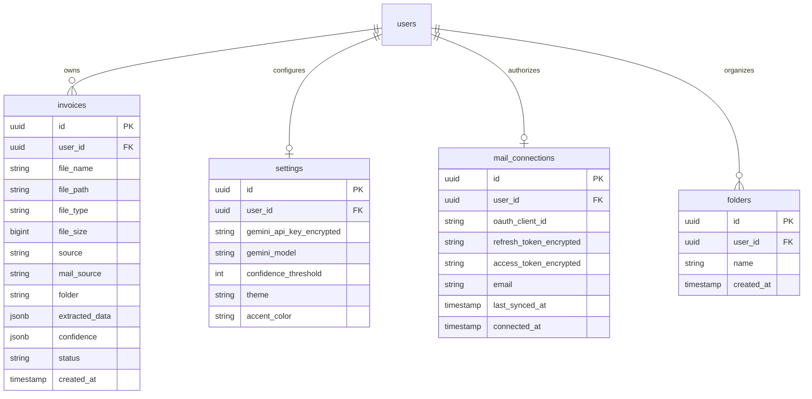
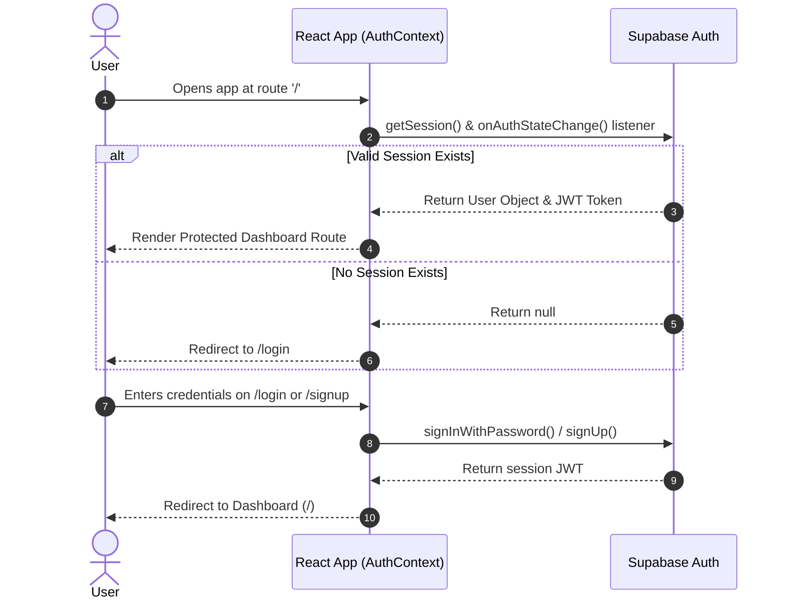
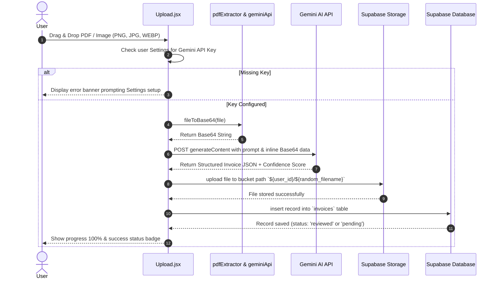
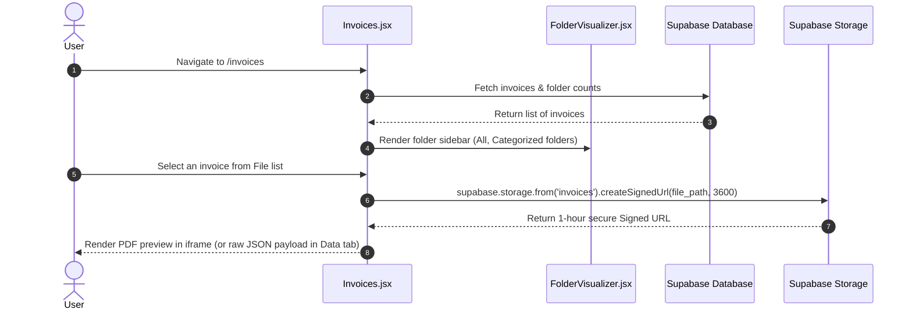
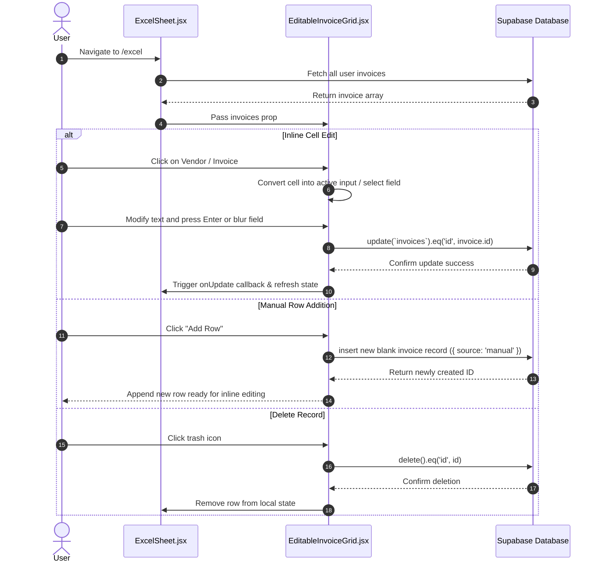
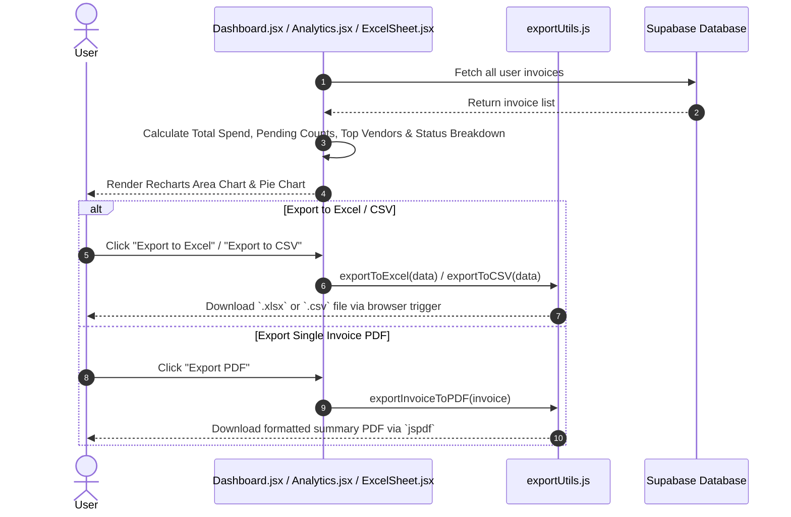

# InvoiceFlow AI — Complete Technical Analysis & Workflow Guide

## Executive Summary

**InvoiceFlow AI** is an intelligent, full-stack invoice processing and management platform built with **React (Vite)**, **Supabase**, **Node.js/Express backend**, and **Google Gemini AI**. 

It eliminates manual data entry by automatically ingesting invoice documents (PDFs, PNG, JPG, WEBP) from drag-and-drop uploads or directly from a user's Gmail inbox. Using multimodal generative AI, it extracts structured metadata (vendor, invoice number, dates, amounts, line items, payment terms, and confidence scores), stores original files securely in cloud storage, provides a folder-based document browser and spreadsheet-style inline editor, and generates visual spending analytics and multi-format exports (CSV, Excel, PDF).

---

## 1. Tech Stack & System Architecture

```mermaid
graph TD
    Client["React 19 Frontend (Vite)"]
    ExpressServer["Express Backend Server (Node.js)"]
    SupabaseDB[("Supabase PostgreSQL DB")]
    SupabaseStore[("Supabase Storage (invoices bucket)")]
    SupabaseAuth["Supabase Auth"]
    GeminiAPI["Google Gemini API (v1beta)"]
    GmailAPI["Google Gmail REST API (v1)"]

    Client -->|Auth / Read & Write Records| SupabaseDB
    Client -->|Direct File Upload / Signed URLs| SupabaseStore
    Client -->|Sign In / Sign Up / Auth Context| SupabaseAuth
    Client -->|Direct AI Extraction (browser key)| GeminiAPI
    Client -->|OAuth Redirect / Code Exchange| ExpressServer

    ExpressServer -->|Sync Mail Endpoint| GmailAPI
    ExpressServer -->|Backend AI Extraction| GeminiAPI
    ExpressServer -->|Store Invoices & Tokens| SupabaseDB
    ExpressServer -->|Upload PDF Attachments| SupabaseStore
```

### Component Breakdown

| Layer | Technologies / Libraries | Role & Description |
| :--- | :--- | :--- |
| **Frontend UI** | React 19, Vite, Lucide Icons | Glassmorphic, dark-mode SPA responsive UI. |
| **Routing** | React Router v7 | Protected route handling, user auth guards. |
| **State & Auth** | Context API, Supabase JS SDK (`@supabase/supabase-js`) | Session tracking, JWT injection, database listeners. |
| **Backend API** | Node.js, Express, `cors`, `dotenv` | Server-side OAuth token exchange, automated Gmail sync, backend Gemini AI fallback extraction. |
| **Database** | Supabase (PostgreSQL) | Relational database with Row Level Security (RLS) policies. |
| **Storage** | Supabase Storage (`invoices` bucket) | Object storage for original invoice PDFs and images with time-limited Signed URLs. |
| **AI Ingestion** | Google Gemini API (`gemini-1.5-flash`, `gemini-2.5-flash`) | Multimodal vision & text extraction into structured JSON with schema enforcement and confidence metrics. |
| **Integrations** | Google Cloud OAuth 2.0 & Gmail API (`googleapis`) | Fetching emails with PDF attachments using offline refresh tokens. |
| **Data Visualization** | Recharts | Area charts for spending trends, Pie charts for status distribution. |
| **Document Export** | `jspdf`, `xlsx` | Exporting spreadsheet data to `.xlsx`, `.csv`, and downloadable PDF summaries. |

---

## 2. Database Schema & Data Model

The application relies on four primary tables in Supabase PostgreSQL:



### Table Definitions & JSON Payload Details

1. **`public.invoices`**
   - Holds metadata for all ingested documents.
   - `extracted_data` (JSONB) format:
     ```json
     {
       "vendor": "Acme Corp",
       "invoiceNumber": "INV-2026-001",
       "date": "2026-08-01",
       "dueDate": "2026-08-31",
       "billTo": "Client Inc",
       "lineItems": [{"desc": "Consulting Services", "qty": 10, "unitPrice": 150, "total": 1500}],
       "subtotal": 1500,
       "taxRate": 10,
       "taxAmount": 150,
       "discount": 0,
       "total": 1650,
       "currency": "USD",
       "paymentTerms": "Net 30",
       "notes": "Payment due upon receipt",
       "confidence": { "vendor": 95, "invoiceNumber": 95, "total": 99, "overall": 92 }
     }
     ```
   - `status`: `'pending'` (if confidence < threshold), `'reviewed'`, `'approved'`, `'paid'`, or `'overdue'`.

2. **`public.settings`**
   - User-level configuration storing the Gemini API key, selected model, confidence threshold (default 70%), and UI styling preferences.

3. **`public.mail_connections`**
   - Gmail OAuth credentials per user including `oauth_client_id`, `refresh_token_encrypted`, `access_token_encrypted`, and `last_synced_at`.

4. **`public.folders`**
   - User custom folder categories for organizing invoice documents.

---

## 3. Detailed End-to-End Workflows

### Workflow 1: Authentication & User Session Lifecycle



- Implementation locations:
  - Context Provider: [src/context/AuthContext.jsx](file:///c:/Users/kanti/.gemini/antigravity/scratch/invoiceflow-ai/src/context/AuthContext.jsx)
  - Protected Route Wrapper: [src/routes/ProtectedRoute.jsx](file:///c:/Users/kanti/.gemini/antigravity/scratch/invoiceflow-ai/src/routes/ProtectedRoute.jsx)
  - Pages: [src/pages/Login.jsx](file:///c:/Users/kanti/.gemini/antigravity/scratch/invoiceflow-ai/src/pages/Login.jsx), [src/pages/Signup.jsx](file:///c:/Users/kanti/.gemini/antigravity/scratch/invoiceflow-ai/src/pages/Signup.jsx), [src/pages/ResetPassword.jsx](file:///c:/Users/kanti/.gemini/antigravity/scratch/invoiceflow-ai/src/pages/ResetPassword.jsx)

---

### Workflow 2: Manual Drag & Drop File Upload & Gemini AI Processing



- Implementation locations:
  - Upload Page: [src/pages/Upload.jsx](file:///c:/Users/kanti/.gemini/antigravity/scratch/invoiceflow-ai/src/pages/Upload.jsx)
  - PDF/File Helpers: [src/utils/pdfExtractor.js](file:///c:/Users/kanti/.gemini/antigravity/scratch/invoiceflow-ai/src/utils/pdfExtractor.js)
  - AI Gemini Extraction: [src/utils/geminiApi.js](file:///c:/Users/kanti/.gemini/antigravity/scratch/invoiceflow-ai/src/utils/geminiApi.js)

---

### Workflow 3: Automated Gmail Ingestion & OAuth Sync

```mermaid
sequenceDiagram
    autonumber
    actor User
    participant Frontend as MailConnect.jsx / Upload.jsx
    participant Express as Express Backend (server.js)
    participant GoogleOAuth as Google OAuth 2.0
    participant GmailAPI as Gmail REST API
    participant Gemini as Gemini AI API
    participant Supabase as Supabase DB & Storage

    rect rgb(20, 30, 50)
    note right of User: Step A: OAuth Authorization Setup
    User->>Frontend: Enter OAuth Client ID & Click "Connect Account"
    Frontend->>GoogleOAuth: Redirect to accounts.google.com/o/oauth2/v2/auth (scope: gmail.readonly)
    GoogleOAuth-->>User: Prompt Consent Screen
    User->>GoogleOAuth: Approve Access
    GoogleOAuth->>Frontend: Redirect to /mail/callback?code=AUTH_CODE
    Frontend->>Express: POST /api/exchange-token { code, clientId, userId }
    Express->>GoogleOAuth: Exchange auth code for tokens (OAuth2 Client)
    GoogleOAuth-->>Express: Return access_token & refresh_token
    Express->>Supabase: Update `mail_connections` table with refresh token
    end

    rect rgb(30, 50, 40)
    note right of User: Step B: Email Ingestion & Automated AI Extraction
    User->>Frontend: Click "Sync Now"
    Frontend->>Express: POST /api/sync-mail { userId } (with Bearer JWT)
    Express->>Supabase: Get refresh_token from `mail_connections`
    Express->>GmailAPI: Search messages: `has:attachment filename:pdf after:${last_synced}`
    GmailAPI-->>Express: List of matching email messages
    loop For each message & PDF attachment
        Express->>Supabase: Check if file_name already processed for user (Deduplication)
        alt Duplicate found
            Express->>Express: Skip processing
        else New PDF Attachment
            Express->>GmailAPI: Download attachment buffer
            Express->>Supabase: Upload file to Supabase Storage (`invoices` bucket)
            Express->>Gemini: Call backend extractWithGemini(base64, pdf) with model fallbacks
            Gemini-->>Express: Structured JSON & Confidence
            Express->>Supabase: Insert invoice record with `source: 'mail'` & `extracted_data`
        end
    end
    Express->>Supabase: Check & retroactively extract AI data for any existing unextracted mail invoices
    Express->>Supabase: Update `last_synced_at` in `mail_connections`
    Express-->>Frontend: { success: true, processed: count, reextracted: count }
    Frontend-->>User: Toast success banner with count of newly imported & re-extracted invoices
    end
```



- Implementation locations:
  - Mail Connect Page: [src/pages/MailConnect.jsx](file:///c:/Users/kanti/.gemini/antigravity/scratch/invoiceflow-ai/src/pages/MailConnect.jsx)
  - OAuth Callback Route: [src/pages/MailCallback.jsx](file:///c:/Users/kanti/.gemini/antigravity/scratch/invoiceflow-ai/src/pages/MailCallback.jsx)
  - Backend Sync Server: [server.js](file:///c:/Users/kanti/.gemini/antigravity/scratch/invoiceflow-ai/server.js)

---

### Workflow 4: Invoice Browser, Secure PDF Preview & Detail View



- Implementation locations:
  - Invoices Page: [src/pages/Invoices.jsx](file:///c:/Users/kanti/.gemini/antigravity/scratch/invoiceflow-ai/src/pages/Invoices.jsx)
  - Folder Component: [src/components/FolderVisualizer.jsx](file:///c:/Users/kanti/.gemini/antigravity/scratch/invoiceflow-ai/src/components/FolderVisualizer.jsx)
  - Drawer Component: [src/components/InvoiceDetailDrawer.jsx](file:///c:/Users/kanti/.gemini/antigravity/scratch/invoiceflow-ai/src/components/InvoiceDetailDrawer.jsx)

---

### Workflow 5: Excel Sheet Inline Editing & Data Management



- Implementation locations:
  - Excel Sheet Page: [src/pages/ExcelSheet.jsx](file:///c:/Users/kanti/.gemini/antigravity/scratch/invoiceflow-ai/src/pages/ExcelSheet.jsx)
  - Grid Component: [src/components/EditableInvoiceGrid.jsx](file:///c:/Users/kanti/.gemini/antigravity/scratch/invoiceflow-ai/src/components/EditableInvoiceGrid.jsx)

---

### Workflow 6: Analytics, Dashboard Summaries & Data Export



- Implementation locations:
  - Dashboard: [src/pages/Dashboard.jsx](file:///c:/Users/kanti/.gemini/antigravity/scratch/invoiceflow-ai/src/pages/Dashboard.jsx)
  - Analytics Page: [src/pages/Analytics.jsx](file:///c:/Users/kanti/.gemini/antigravity/scratch/invoiceflow-ai/src/pages/Analytics.jsx)
  - Export Utilities: [src/utils/exportUtils.js](file:///c:/Users/kanti/.gemini/antigravity/scratch/invoiceflow-ai/src/utils/exportUtils.js)

---

## 4. Key Features & Page Breakdown

```text
InvoiceFlow AI Routes & Features
│
├── /login, /signup, /reset-password   -> Authentication UI backed by Supabase Auth
├── / (Dashboard)                       -> High-level metrics, Recharts trends, recent invoices
├── /upload                             -> Drag-and-drop file upload, instant Gemini OCR & mail sync button
├── /mail & /mail/callback              -> OAuth setup & Gmail API sync trigger
├── /invoices                           -> 3-pane folder browser, file list & secure PDF preview iframe
├── /excel                              -> Excel-like inline editable table, search, filters & row creation
├── /analytics                          -> Deep spending analytics, top vendor breakdown & status distribution
└── /settings                           -> Configure Gemini API key, model selection, and confidence thresholds
```

---

## 5. Security & Privacy Architectural Highlights

1. **Row Level Security (RLS)**:
   - Supabase tables rely on `user_id = auth.uid()` policies, ensuring users can only read, insert, update, or delete their own invoice data.
2. **Time-Limited Storage Signed URLs**:
   - Original invoice PDFs in the `invoices` storage bucket are accessed securely via 1-hour signed URLs (`supabase.storage.from('invoices').createSignedUrl(path, 3600)`), keeping files private from public access.
3. **Backend JWT Forwarding**:
   - The Express backend (`server.js`) passes the user's `Authorization: Bearer <JWT>` header directly to Supabase client calls (`getSupabaseClient(req)`), enforcing RLS even when operations originate from the backend server.
4. **Gmail OAuth Offline Access**:
   - Uses `access_type: 'offline'` and `prompt: 'consent'` to securely retrieve a `refresh_token`, allowing background email ingestion without storing plain email passwords.

---

## 6. Recommendations & Next Steps for Production Readiness

1. **Proxy Browser Gemini API Calls**:
   - Currently, `Upload.jsx` calls the Gemini API directly from the browser using the user's saved API key. For enterprise security, route all Gemini API calls through the Express backend or a Supabase Edge Function to avoid key leakage.
2. **Automate Gmail Sync via Cron Jobs**:
   - Connect the `/api/sync-mail` endpoint to a scheduled background worker (e.g. Node-cron, Supabase Scheduled Functions, or Cloud Scheduler) to automatically pull new invoices every 15 minutes.
3. **Complete Database Encryption**:
   - Encrypt `refresh_token_encrypted` and `gemini_api_key_encrypted` at rest using AES-256 in PostgreSQL using `pgcrypto` before storing in the database.
4. **Automated Testing Suite**:
   - Add unit tests for `geminiApi.js` JSON parsing and end-to-end integration tests using Vitest and Playwright.
